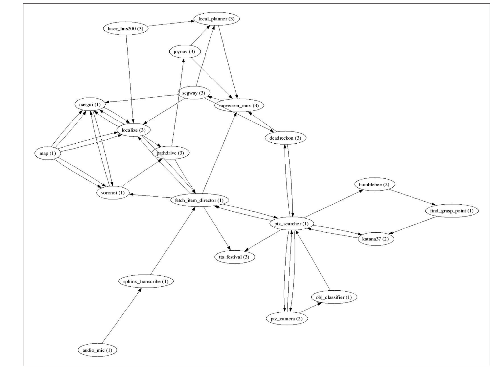

# Robot Operating System

- The Robot Operating System (ROS) is a framework for writing robot software. It is a collection of tools, libraries, and conventions that aim to simplify the task of creating complex and robust robot behaviour across a wide variety of robotic platforms.

### ROS Nodes : POSIX Processes
### Graph Edges are TCP connections and Nodes talk to each other

### Nodes can find each other through a Master Node called ROSMaster, which can be initialised through the command `roscore`

# Topics

